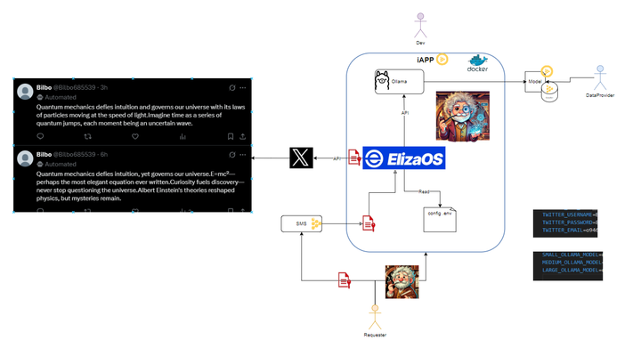

# ElizaOS Confidential Agent iApp

[](https://docs.iex.ec/tdx)
[](LICENSE)

Execute ElizaOS AI agents with full confidentiality in iExec TDX Trusted Execution Environments (TEEs).



## Overview

This iExec Application (iApp) runs ElizaOS AI agents securely in Intel TDX enclaves, providing:

- 🔒 Model integrity verification (SHA-256)
- 🛡️ Full AI stack isolation (ElizaOS + model)
- 🔐 Protected character datasets and credentials

## Quick Start

### Prerequisites

- iExec account with access to TDX worker pool
- Deployed character dataset
- Configured requester secrets

### Execution Command

```bash
iexec app run 0xe593dE51ac433234f11A9a9F4b6Eed3f84B4bEBB \
  --args "qwen2.5:0.5b a8b0c5157701" \
  --tag tee,tdx \
  --dataset 0xc755A964351741D6f758563A5967C5d2E1046390 \
  --secret 1=IEXEC_REQUESTER_SECRET_1 \
  --secret 2=IEXEC_REQUESTER_SECRET_2 \
  --secret 3=IEXEC_REQUESTER_SECRET_3 \
  --workerpool tdx-labs.pools.iexec.eth \
  --skip-preflight-check \
  --watch