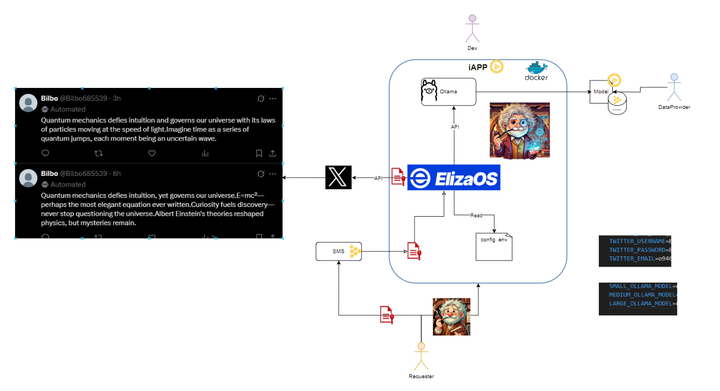

# ElizaOS Confidential Agent iApp

[](https://protocol.docs.iex.ec/for-developers/confidential-computing/create-your-first-tdx-app)
[](LICENSE)

Execute ElizaOS AI agents with full confidentiality in iExec TDX Trusted Execution Environments (TEEs).

🧵 Use case: In this demo, the agent impersonates a custom character and posts tweets on the user’s X (Twitter) account based on the character’s personality and configuration.


## 🧠 Overview

This iExec Application (iApp) runs ElizaOS AI agents securely inside Intel TDX enclaves, providing:

- ✅ Model integrity verification using model ID (e.g., SHA-256)
- 🛡️ Full isolation of the AI stack (Eliza Agent + model)
- 🔐 Support for protected character datasets and user credentials
  



---

## 🧪 Local Testing with Docker

You can run and test the iApp locally in a Docker container before deploying it on iExec.

---

### 1. Retrieve Model Name and Model ID

To run an agent, you need:

- **Model name** (e.g., `qwen2.5:0.5b`)
- **Model ID** (e.g., `a8b0c5157701`)

➡️ Visit [https://ollama.com/search](https://ollama.com/search)
Select a model, and you will find:

- The **model name** at the top
- The **model ID** (short hash or full SHA256) in the model details/download section

⚠️ **Make sure the model is supported by ElizaOS.** Stick with small/medium-sized models like 0.5b for local runs.

---

### 2. Prepare the Character File

The agent expects a **character definition file** as input in the `iexec_in` folder. This file must follow the ElizaOS character format.

An example is provided in:

```bash
iexec_in/character
```

Modify it to fit your custom personality, prompt, and configuration.


### 3. Build the Docker Image

Build the Docker image locally:

```bash
docker build -t eliza .
```

### 4. Run the iApp Locally
Run the app using Docker:

```bash
docker run --rm --name eliza \
  -v ./iexec_in:/iexec_in \
  -v ./iexec_out:/iexec_out \
  -e IEXEC_DATASET_FILENAME=eliza.char \
  -e IEXEC_IN=/iexec_in \
  -e IEXEC_OUT=/iexec_out \
  -e IEXEC_REQUESTER_SECRET_1="your-username" \
  -e IEXEC_REQUESTER_SECRET_2="your-email@example.com" \
  -e IEXEC_REQUESTER_SECRET_3="your-password" \
  eliza:latest "<model_name> <model_id>"
```

➡️ Result: The agent will generate and post content on your X (Twitter) profile according to the personality and behavior defined in your custom character file.

### 🚀 Run on iExec TDX Production
When you're ready to run on iExec TDX (application deployed, dataset deployed, and requester secrets pushed):

```bash
iexec app run <APP_ADDRESS> \
  --args "<model_name> <model_id>" \
  --tag tee,tdx \
  --dataset <DATASET_ADDRESS> \
  --secret 1=IEXEC_REQUESTER_SECRET_1 \
  --secret 2=IEXEC_REQUESTER_SECRET_2 \
  --secret 3=IEXEC_REQUESTER_SECRET_3 \
  --workerpool tdx-labs.pools.iexec.eth \
  --skip-preflight-check \
  --watch
```